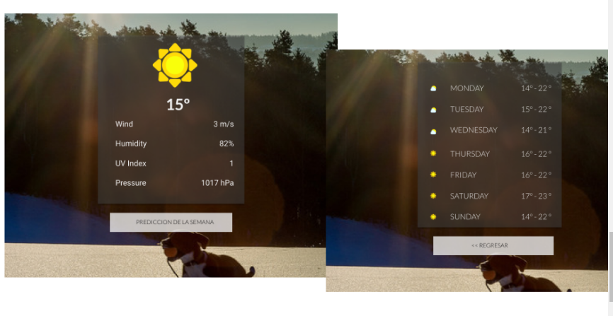

# WEATHER
## Descripción

¿Has visto que los sistemas operativos móviles vienen con una APP de predicción del clima? ¡Vamos a hacer la nuestra! Para ello, usaremos la API de Dark Sky y esperemos llegues a usar un API de imágenes como Flickr, Unsplash u otro. A continuación te dejamos unos slides con algunos recursos y guías del flujo de la app. Recuerda que no es necesario que sigas el diseño al pie de la letra, eres completamente libre de adaptarlo a tus gustos.

##  Recursos utilizados

* HTML5
* CSS
* JQUERY
* Eslintrc 
* Bootstrap
* API de Dark Sky
* API Flickr

## Autores

* Pamela Rojas
* Jymma Mogollon

## Archivos utilizados

* README.md con descripción del proyecto con la  API de Dark Sky.
* index.html: Página web.
* .eslintrc con configuración para linter.
* .gitignore para ignorar node_modules u otras carpetas que no deban incluirse en control de versiones.
* package.json con nombre, versión, descripción, autores, licencia, dependencias, scripts (pretest, test, ...)

## Producto

## Licencia

*Copyright (C) 2018 ~ * 